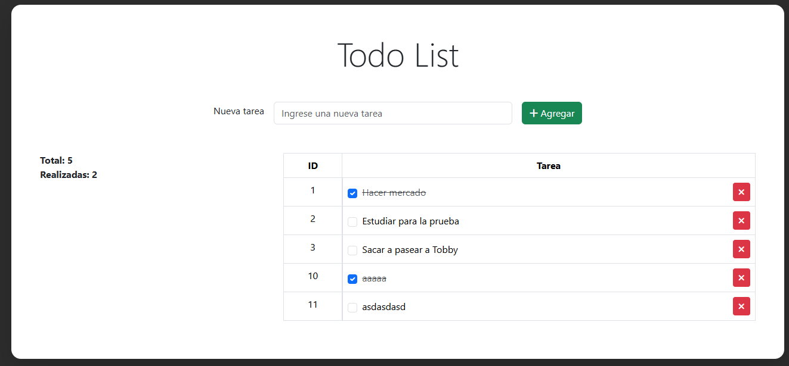

# Desafío 04 - Todo List

Este proyecto contiene ejercicios de JavaScript con funciones para Desafío Latam.

## Demo

[Ver Demo en Vivo](https://edolivares.github.io/desafio_latam_G103_JS_desafio_04/)

## Todo List

Aplicación de lista de tareas desarrollada con JavaScript vanilla y Bootstrap.

- Agregar tareas desde el input o presionando Enter
- Marcar tareas como completadas haciendo click en el checkbox o en el texto
- Eliminar tareas con el botón de eliminar
- Contador de tareas totales y realizadas que se actualiza en tiempo real
- Se agrega índice global al generar nuevas tareas y se guarda en localStorage
- La información de las tareas, y su estado, se guarda en localStorage para mantener consistencia de datos
- Los IDs son consecutivos respetando el último índice generado (si eliminas la tarea con ID 3, la siguiente será 5, no 4)

**Desarrollado para Desafío Latam - Módulo JavaScript Básico**

